# Analysis

## Why does MarketMaker beat AvellanedaStoikov in everything here? 

`MarketMaker` outperforms `AvellanedaStoikovMarketMaker` in everything (on average). A few reasons why, briefly:

- **AS hugs fair value more closely**, which hurts it here, e.g. the historical backtest shows AS tracking the real price anchor tighter than MarketMaker (mean deviation 1.041 vs 1.305). Trading at fair value results in less spread.

- **`k` (order-arrival decay) is uncalibrated.** AS's spread formula assumes fill probability decays exponentially with distance from mid at rate `k`, a real empirical quantity in markets. Here we hand-picked it and briefly saw the 'best' one, on the tuning grid, for this GBM arrival process.

- **`MarketMaker`'s heuristic is directly fit to this environment.** Its `spread`/`skew_coef`/`vol_coef` knobs have no economic justification. AS is constrained by a structural form derived for real market microstructure that this toy flow model doesn't match.

- **The gap survives tuning**, so it isn't a bad `gamma`/`k` pick, AS's own best grid cell (1438.45) still trails MarketMaker's best (2405.79), meaning the model has a genuinely lower ceiling in this environment, not just an untuned one.

As noted above, this says more about this sim's uncalibrated parameters and toy order-flow model than about which strategy is "better" in a real market.

## Important Pricing Issue 

We would like to be able to compare and analyse results from out code. One major issue is that our market makers quotes often shape the market and have a heavy influence on the mid-price.

`random_flow.py`'s synthetic limit orders anchor to `book.mid_price()` every step, and a resting market maker's own bid/ask are frequently the best bid/ask in the book, so the "market" a strategy is scored against isn't independent of the strategy itself. It results in heavy bias and creates a feedback loop, i.e `MarketMaker` quotes, that quote often sets the mid, the next synthetic order re-centers on that new mid, `MarketMaker` quotes again around it, and so on. Two consequences follow directly:

- **Tuning sweeps can crown the wrong "best" config.** A `spread`/`max_inventory` (or `gamma`/`k`) combination isn't just scored on how well it manages inventory risk against the market, it's also scored on how favourably it happens to interact with its own feedback loop. 
- **Head-to-head comparisons.** `MarketMaker` and `AvellanedaStoikovMarketMaker` quote differently, so even reseeded to the same starting seed, each shapes *its own* book's mid differently once it starts quoting

The fix used throughout the sections below is to stop letting the mid come from the book at all. `simulate_historical_flow` (`simulator/historical_flow.py`) anchors every synthetic order to an externally supplied price series instead of `book.mid_price()`, so nothing any agent does can move the price its own P&L is later measured against. That series can be a synthetic price path (`simulator/gbm_flow.py`, driftless or with drift confined to `InformedTrader`'s own known windows) or a real historical one (`data/btcusdt_1m.csv`) — either way, it's fixed before the run starts and no agent's quotes can touch it. Sections below are marked by which price process they use, so results that still run against the self-referential walk aren't mistaken for the corrected ones.

`simulator/gbm_flow.py`'s synthetic path is now GARCH(1,1) with Student-t innovations, not plain constant-volatility GBM — see "GBM Priced" below for why that changed and what it fixes.

We also include a section where we extract real historical data towards the end.

## GBM Priced (GARCH(1,1) implementation)

Plain GBM assumes constant volatility, missing the fat tails and volatility clustering real markets show. `generate_garch_gbm_path` replaces the fixed sigma with a GARCH(1,1) process, i.e, each step has conditional variance `omega + alpha * eps^2 + beta * sigma2`, so a large shock raises the variance and volatility clusters ahead instead of staying flat. `sigma2` starts at the unconditional variance `omega / (1 - alpha - beta)`, and `alpha + beta < 1` keeps the process stationary. Innovations (eps) are drawn from a standardized Student-t(nu=5) rather than Gaussian, adding fat tails on top of the variance clustering. Prices still follow the same discretized log-return step as plain GBM, `S_(t+1) = S_t * exp(mu - sigma^2/2 + eps)`, just with `eps` now GARCH-Student-t distributed not Gaussian, allowing for better realism.

### Strategy comparison - Please see tuning after for explanation

`analysis/compare_strategies.py` runs the simulation across 200 independent random seeds and compares `MarketMaker`, `AvellanedaStoikovMarketMaker`, and `ImbalanceTrader` on final mark-to-market P&L. `MarketMaker` and `AvellanedaStoikovMarketMaker` each get their own simulation per seed rather than sharing one book (quotes still add shape), but both are anchored to the identical GARCH-GBM path for that seed, generated fresh per seed rather than reused across seeds.

```bash
python -m analysis.compare_strategies
```

```
200 runs, 0-199

MarketMaker        mean=  -143.20  stdev= 1482.13  min= -9461.07  max=  3297.12  profitable=102/200 ( 51.0%)
AvellanedaStoikov  mean= -1626.25  stdev= 1442.43  min= -8950.71  max=   687.59  profitable= 12/200 (  6.0%)
ImbalanceTrader    mean=  -593.73  stdev= 2215.07  min= -6975.88  max= 10963.06  profitable= 80/200 ( 40.0%)

MarketMaker beat ImbalanceTrader head-to-head in 124/200 runs (62.0%)
AvellanedaStoikov beat ImbalanceTrader head-to-head in 83/200 runs (41.5%)
AvellanedaStoikov beat MarketMaker head-to-head in 5/200 runs (2.5%)
```

The `min`/`max` columns show the fat tails directly: every agent's worst and best run got noticeably more extreme than the old plain-GBM figures (e.g. `MarketMaker`'s min went from -5406.92 to -9461.07, `ImbalanceTrader`'s max from 6171.42 to 10963.06), the GARCH path's occasional large Student-t shocks show up as real tail P&L, not just a wider mean/stdev.


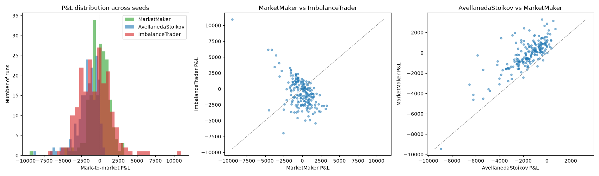

## Is it a Tuning Issue?  - Streamlit recomennded to test variety of parameters

### Linear heuristic tune

`analysis/tune_market_maker.py` sweeps `MarketMaker`'s `spread` and `max_inventory` across a grid (`ImbalanceTrader` present, same as above), anchored to the same GARCH-GBM exogenous price path per seed as the strategy comparison above.

```bash
python -m analysis.tune_market_maker
```

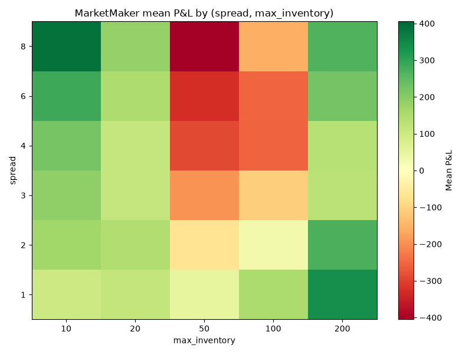

Performance rises with `spread` almost everywhere in the grid since wider quotes simply capture more per fill. The interaction with `max_inventory` flips direction as `spread` widens, at `spread=1`, a bigger inventory cap makes things steadily worse, since the extra exposure isn't compensated by a wide enough spread. The best cell is `spread=8, max_inventory=50` (mean P&L 2405.79, 92% profitable), still the widest spread in the grid, but now a *mid-sized* cap rather than the largest one. That's a genuine shift from the old plain-GBM sweep (which crowned `max_inventory=200`, the largest cap): under fat tails an occasional large shock can hit a big resting inventory much harder, so the best cap now trades off some upside against limiting exposure to that tail risk, instead of just maximizing exposure to the (previously thinner-tailed) trend.

### Avellaneda-Stoikov tune

`AvellanedaStoikovMarketMaker`'s knobs (`gamma`risk aversion and `k` order-arrival decay) aren't comparable to `MarketMaker`'s (`spread`, `max_inventory`), so this gets its own sweep rather than an extra axis on the grid above. 

```bash
python -m analysis.tune_avellaneda_stoikov
```

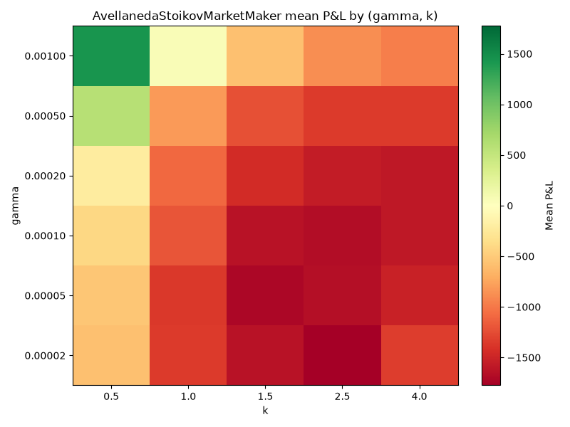

The default (`gamma=0.0001, k=1.5`) used previously is nowhere close to the best. Performance rises almost monotonically with `gamma` at every `k` tested. A heavily risk averse quoter skews its reservation price hard against inventory on every fill and against a price it genuinely can't influence, skew saves us. `k` matters too since `k=0.5`, the tightest order-arrival floor, outperforms every wider `k` at every `gamma` tested. The best cell is `gamma=0.001, k=0.5` (mean P&L 1438.45, 86% profitable) the highest risk aversion and the tightest floor in the grid, the same corner as before; the fat tails and clustering lower the mean P&L somewhat (1562.08 → 1438.45) but don't change which corner wins.

The best cell comfortably clears `ImbalanceTrader`'s own mean (-593.73) from the strategy comparison above, unlike the untuned default. So the mixed/losing strategy-comparison result above is a default-tuning artifact.

I recommend the reader use the streamlit app to investigate and play with these parameters. As well as seeing the impact of a informed trader on these results.

## Adverse selection stress test

Nobody in a plain GARCH-GBM path knows where price is going next, so any adverse selection `MarketMaker` suffers there is incidental. `simulator/informed_trader.py` adds `InformedTrader`, fed a ground-truth schedule of future price drift windows at construction, which trades a market order in that direction every step a window is active. To keep that edge the price itself carries drift only during those same windows instead. `simulator/gbm_flow.py`'s `generate_scheduled_drift_garch_gbm_path` builds a GARCH-GBM path from `InformedTrader`'s own `schedule`, drift on during the window, so the move is in the exogenous anchor not dependent on order flow.

`analysis/stress_test_market_maker.py` runs `MarketMaker` against two 50-step informed windows (a "buy" drift, then later a "sell" drift), recording `spread_pnl`/`inventory_pnl` via `PnLHistory` throughout:

```bash
python -m analysis.stress_test_market_maker
```

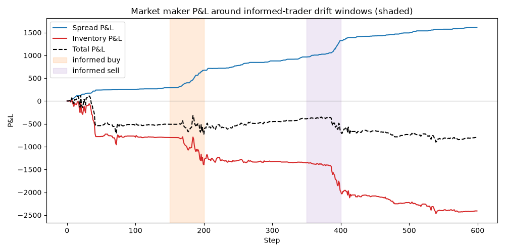

`spread_pnl` climbs steadily throughout the run, `MarketMaker` is still earning its edge on every individual fill. `inventory_pnl` tells the opposite story, it craters right as each window opens, as `MarketMaker` keeps quoting a spread around a mid the scheduled drift is actively walking away from it. Essentially, you're buying into a rise then getting caught short into a further fall. 

### Does widening protect you? Does skew help you recover? 

Two independent parameters are available to test: `vol_coef` (widens quotes with realized volatility), `skew_coef` (multiplies the inventory-skew term; `skew_coef=0` disables it). Sweeping both across `{0, 1} × {0, 1}`, 30 seeds each, and measuring the worst `inventory_pnl` drawdown in the window, then the mean `abs|inventory|` over the 50 steps after a window ends (how close it's gotten back to flat).

```
vol_coef=0.0  skew_coef=0.0  mean_drawdown=  -967.21  mean_|inventory|_after= 46.59
vol_coef=0.0  skew_coef=1.0  mean_drawdown=  -971.36  mean_|inventory|_after= 40.25
vol_coef=1.0  skew_coef=0.0  mean_drawdown=  -846.71  mean_|inventory|_after= 46.59  <-- smallest drawdown
vol_coef=1.0  skew_coef=1.0  mean_drawdown=  -895.37  mean_|inventory|_after= 38.78  <-- fastest reversion
```

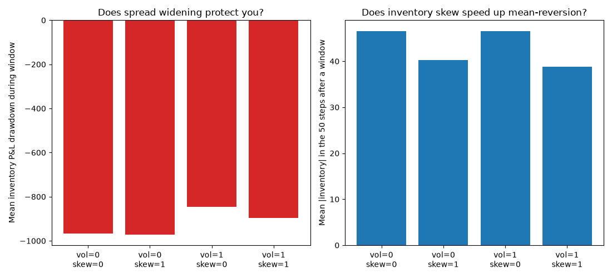

**Skew helps mean-revert, cleanly and consistently.** Both `skew_coef=1.0` rows post a lower `mean_|inventory|_after` than the matching `skew_coef=0.0` row, regardless of `vol_coef` since skewing quotes against inventory pulls the position back toward flat faster once the drift window ends.

**Widening modestly helps drawdown at both `skew_coef` settings, and the two parameters don't fight each other.** `vol_coef=1` improves drawdown over `vol_coef=0` whether `skew_coef` is 0 (-967.21 to -846.71) or 1 (-971.36 to -895.37), a small, consistent improvement in both cases rather than a sharp interaction effect.

Informed trader always has marketable orders regardless of `MarketMaker`'s spread, widening doesn't stop it from trading, it changes *who* it trades against. A wider `MarketMaker` quote sits further from the top of book, so more of the flow gets absorbed by other resting synthetic orders instead of `MarketMaker` itself.


### Avellaneda_stoikov_demo (default)

`analysis/avellaneda_stoikov_demo.py` runs both market makers through the identical informed-trader stress scenario from the section above (same schedule, same scheduled-drift GARCH-GBM path):

```bash
python -m analysis.avellaneda_stoikov_demo
```

```
MarketMaker:                 spread_pnl=2226.74, inventory_pnl=-2264.44, total=-37.70
AvellanedaStoikovMarketMaker: spread_pnl=852.07, inventory_pnl=-2533.78, total=-1681.70
```

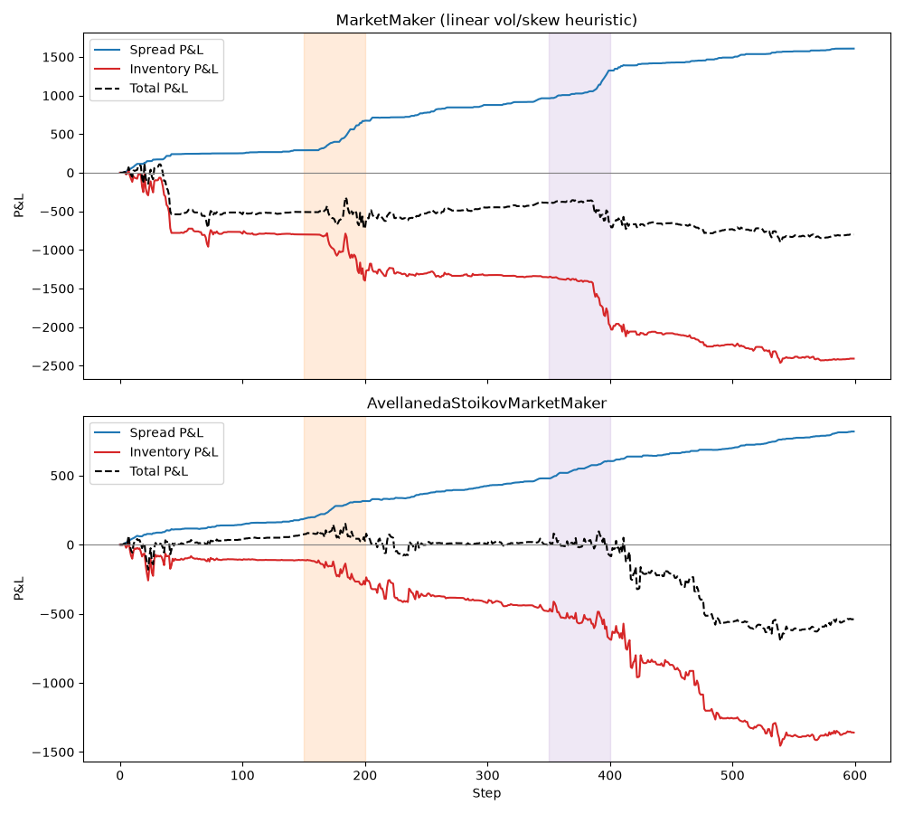

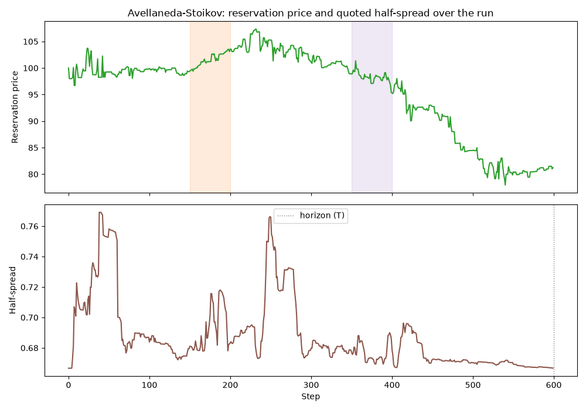

`AvellanedaStoikovMarketMaker` takes a *larger* `inventory_pnl` hit here than the linear heuristic (-2533.78 vs. -2264.44) and finishes well behind it (-1681.70 vs. -37.70). It's running at `gamma=0.0001`, the specific setting the tuning sweep above shows is the worst in the grid. 

### Is this actually high-frequency trading?

The AS paper is titled "High-frequency trading in a limit order book" and the strategy where you continuously re-quote both sides. What this project simulates is the *strategy*, not the *speed* real high frequency trading needs to run it profitably.

## Non GBM

## Real historical data backtest (2026-08-30, 14:21–22:40 UTC)

Everything above anchors to a synthetic GARCH-GBM price path i.e exogenous, and now shaped to carry BTCUSDT-like fat tails and volatility clustering, but still not the *actual* historical path: no genuine drift, no real jump timing and no event influence. `analysis/historical_backtest.py` swaps that for `simulator/historical_flow.py` anchored to an actual historical series instead, `data/btcusdt_1m.csv`, 1000 minutes of real BTCUSDT 1-minute close prices (no authentication required; fetched once and committed as a static CSV).

Order-level replay of genuine market microstructure requires licensing, so **the fair-value process is real, the order arrivals around it are still synthetic**, generated the same way the GARCH-GBM-anchored runs above are. We experience the actual drifts and jumps this market had, not just another distribution — we are only pinned to one 1000 minute window.

Since the real series (~78,000-79,000) and the sim's usual scale (agent defaults tuned around ~100) don't match, `rescale_to_sim_scale()` rebuilds a ~100 based series by replaying the real data's actual percentage returns onto a synthetic starting price, the real shape (drift, volatility, jump timing), on a compatible scale.

```bash
python -m analysis.historical_backtest
```

```
Backtest: 500 steps of real BTCUSDT 1-minute closes (data/btcusdt_1m.csv)

MarketMaker:                 spread_pnl=919.10, inventory_pnl=-210.24, total=708.86
AvellanedaStoikovMarketMaker: spread_pnl=610.80, inventory_pnl=-283.51, total=327.28

Mean |book mid - real anchor|: MarketMaker=1.305, AvellanedaStoikov=1.041
```

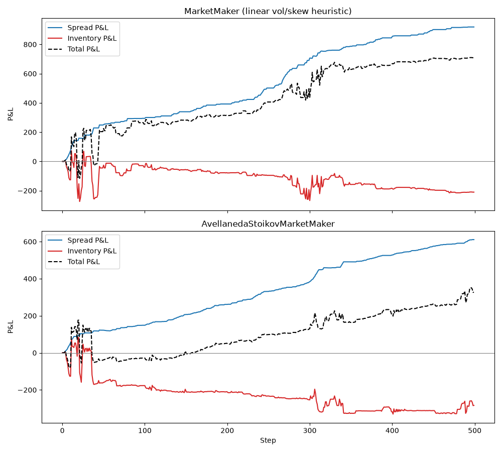

Both market makers finish profitable against this real window; a calm one, only a 1.32% price range across the whole 500 minutes. `MarketMaker` outperforms `AvellanedaStoikovMarketMaker` here (708.86 vs 327.28), consistent with every other default `gamma` comparison in this README (the strategy comparison, the adverse-selection demo). However, this is still one 500-minute window out of however many the market could have taken.

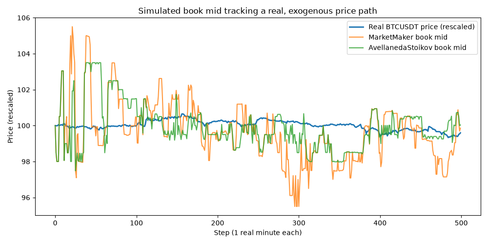

 Both books are anchored to the *identical* real price series, any gap between the two is a direct read on which market maker's own resting quotes perturb the book furthest from the true exogenous price. There is a real, measurable, gap `AvellanedaStoikovMarketMaker` tracks the real anchor noticeably tighter than `MarketMaker` (mean `|book mid - real anchor|` 1.041 vs 1.305, about 20% tighter). Neither book tracks the real series' exact tick-by-tick path — both are dominated by the synthetic order-placement noise (`±3` on a ~100 base, inherited unchanged from `random_flow.py`) relative to this particular window's small real volatility (1.32% range) — but `AvellanedaStoikovMarketMaker`'s reservation-price mechanism visibly holds closer to fair value than `MarketMaker`'s linear skew does.

## Example output from main

Running `main.py` produces `images/simulation.png` — mid price, spread, and order book imbalance over the course of the simulated run — and `images/depth_heatmap.png`, showing resting order book depth by price offset from mid over time (green = bid side, red = ask side):

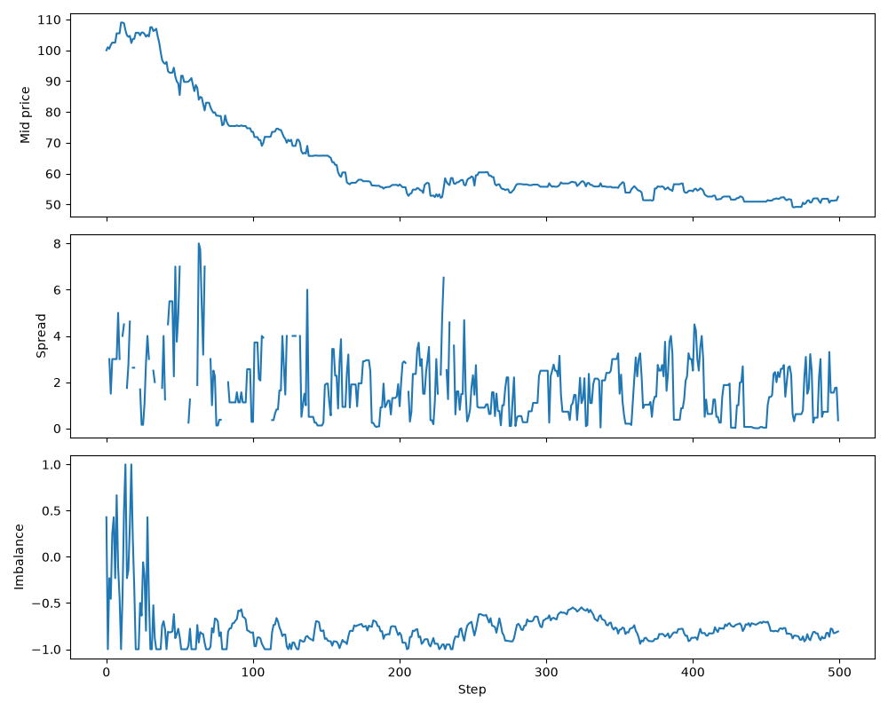

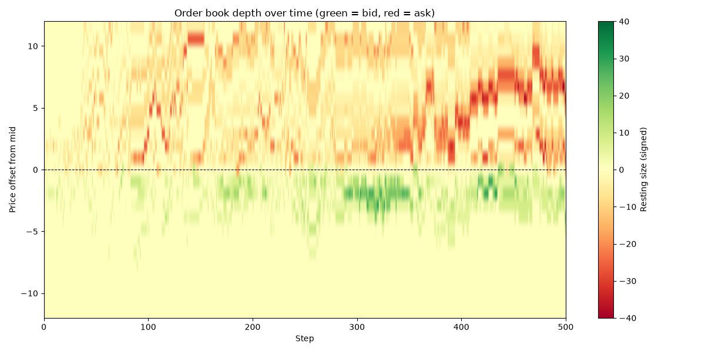


## Steamlit 


`streamlit_app.py` wraps the simulation code in a two-tab UI.

**Single run** — choose a market maker (`MarketMaker` or `AvellanedaStoikovMarketMaker`) and its parameters, optionally add imbalance trader or informed stress and simulate a seed, yielding `Metrics`, `DepthHistory`, `PnLHistory` charts. A **Use GBM exogenous price path** checkbox in the sidebar switches the run from `simulate_random_flow`'s self referential walk to a GARCH-GBM path anchored via `simulate_historical_flow` (see "Strategy comparison" below). With it on, the tab also plots the GBM anchor against the book's own mid and reports the mean `|book mid - GBM anchor|` deviation, the same self-influence check `analysis/historical_backtest.py` runs against real data. 

There is also a **Use best known parameters** button which sets parameters to the best ones found in the GARCH-GBM-anchored market maker sweeps for both models, *'the best'* here is only measured against the *imbalance trader not informed*.

`spread=8, max_inventory=50` for `MarketMaker` from `analysis/tune_market_maker.py`

`gamma=0.001, k=0.5` for `AvellanedaStoikovMarketMaker` from `analysis/tune_avellaneda_stoikov.py`

**Compare configurations** — set up two independent market-maker configs (A and B, any mix of model/parameters) and run them against identical input order flow, same reseed-then-diverge pattern `analysis/compare_strategies.py` uses. At 1 seed it shows a full P&L breakdown plus a total-P&L-over-time chart for each side; above 1 seed it reseeds and reruns both configs across that many seeds instead and reports the mark-to-market P&L distribution.
