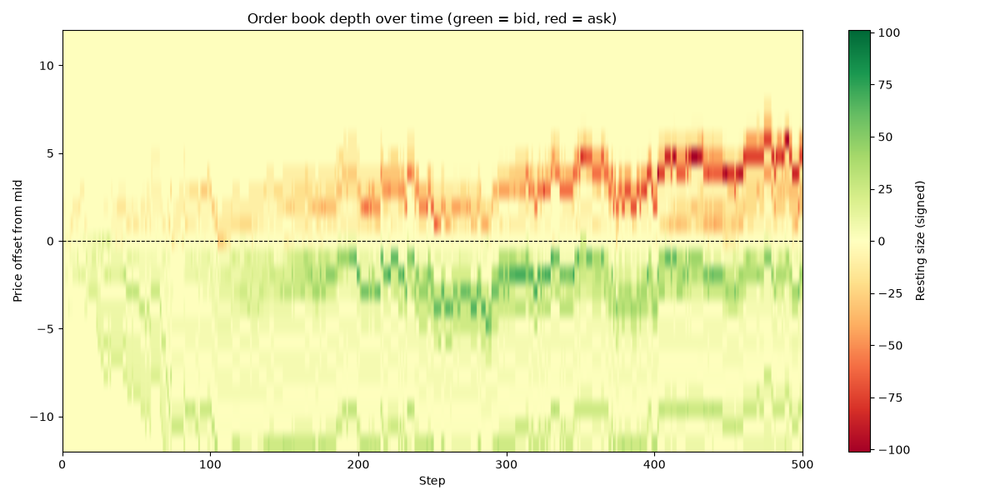

# Market Sim


A limit order book (LOB) simulator written from scratch in Python — the matching engine, random order flow, two contrasting trading agents, and metrics tracking, with a pytest suite and mypy checking the core engine.

## Features

- **Matching engine** (`lob/book.py`) — limit and market orders, price-time priority, partial fills, cancellation. Best bid/ask lookup is heap-based (`O(log n)` amortized) rather than scanning every price level.
- **Random order flow** (`simulator/random_flow.py`) — Poisson-style arrivals of random limit/market orders around the mid price, to simulate a live market.
- **Market maker** (`simulator/market_maker.py`) — quotes a bid and ask around mid every step, tracks its own inventory/cash, and skews its quotes against inventory to manage risk.
- **Imbalance trader** (`simulator/imbalance_trader.py`) — a contrasting agent that trades *with* the book's imbalance instead of against its own inventory.
- **Metrics** (`metrics/metrics.py`) — tracks mid price, spread, depth, and order book imbalance over a run, and plots them.
- **Depth heatmap** (`metrics/depth_history.py`) — records resting size at every price level relative to mid, each step, and renders it as an L2-style heatmap over time.
- **Tests** (`tests/`) — pytest unit tests covering matching, price-time priority, partial fills, cancellation, and both agents; mypy runs in CI alongside pytest.
- **Benchmarks** (`benchmarks/`) — measures the heap-based best bid/ask lookup against the naive scan it replaced.

## Project structure

```
market_sim/
├── lob/
│   └── book.py                  # core order book: Order, LimitOrderBook
├── simulator/
│   ├── random_flow.py           # random order flow generator
│   ├── market_maker.py          # market-making agent
│   └── imbalance_trader.py      # imbalance-following agent
├── metrics/
│   ├── metrics.py                # metrics tracking + plotting
│   └── depth_history.py         # per-step depth snapshots + heatmap
├── tests/
│   ├── test_book.py             # matching engine tests
│   ├── test_market_maker.py
│   ├── test_imbalance_trader.py
│   └── test_depth_history.py
├── benchmarks/
│   └── bench_best_price.py      # best bid/ask lookup benchmark
├── main.py                       # demo entry point
├── requirements.txt
└── diary.md                      # dev log
```

## Quickstart

```bash
git clone <your-repo-url>
cd market_sim
pip install -r requirements.txt
python main.py
```

`main.py` runs a short manual demo — placing, matching, and cancelling orders — then a 500-step random-flow simulation with both agents active, saving a chart of mid price / spread / imbalance to `simulation.png` and a depth heatmap to `depth_heatmap.png`.

## Running tests

```bash
python -m pytest -v
python -m mypy lob simulator metrics --ignore-missing-imports --explicit-package-bases
```

## How the order book works

A limit order book (LOB) is the mechanism an electronic exchange uses to match buyers and sellers in real time. Every time a trader submits an order, the exchange doesn't magically "find a counterparty" — instead it places that order into the book, a structured list of all outstanding buy and sell interest.

Buy orders (bids) are sorted so the highest bid represents the most someone is willing to pay, and sell orders (asks) are sorted so the lowest ask represents the cheapest someone is willing to sell. These two prices form the top of the book, and the difference between them is the **bid-ask spread**, a key measure of market liquidity.

When a new order arrives, the exchange checks whether its price is good enough to trade immediately against the opposite side — this is called being **marketable**. A buy order priced above the best ask will instantly execute against the cheapest available sell orders. Trades always follow **price-time priority**: better prices match first, and among equal prices, older orders match before newer ones. If the incoming order isn't fully filled, whatever remains is added to the book at its limit price.

`LimitOrderBook` stores bids and asks in dictionaries mapping price → FIFO queue, which enforces price-time priority. `_best_bid()`/`_best_ask()` identify the top of the book. When an order arrives through `add_limit_order()`, the book checks whether it's marketable and matches it inside `_match_buy()`/`_match_sell()`, reducing sizes on both sides and recording each trade. Fully filled resting orders are removed from their queues, and empty price levels are deleted. Any unfilled remainder is added to the book. `snapshot()` returns a summary of the current state — best bid/ask, depth at each price, and recent trades.

## How the market maker works

A market maker doesn't bet on direction — it continuously posts both a bid and an ask around the current price, earning the spread on round trips. In exchange for supplying that liquidity, it absorbs inventory risk: every fill pushes its position long or short, so `MarketMaker` skews its quotes against its own inventory (long → quote lower, short → quote higher) to lean back toward flat instead of letting risk build up unbounded, and stops adding to a side once a configurable `max_inventory` limit is hit.

## Performance

`_best_bid()`/`_best_ask()` used to scan every resting price level with `max()`/`min()` on every call — `O(n)` in the number of price levels, and these are called on nearly every operation. They're now backed by a heap (bids negated to simulate a max-heap; lazy deletion for entries whose price level has since emptied out), which keeps lookups `O(log n)` amortized regardless of how many levels are resting.

```bash
python benchmarks/bench_best_price.py
```

```
  levels    dict max()     heap peek   speedup
      10        1.32ms        0.40ms      3.3x
     100        6.61ms        0.34ms     19.4x
    1000       60.36ms        0.35ms    174.4x
   10000      475.84ms        0.24ms   1987.7x
   50000     2864.49ms        0.27ms  10423.9x
```

## Example output

Running `main.py` produces `simulation.png` — mid price, spread, and order book imbalance over the course of the simulated run — and `depth_heatmap.png`, showing resting order book depth by price offset from mid over time (green = bid side, red = ask side):


