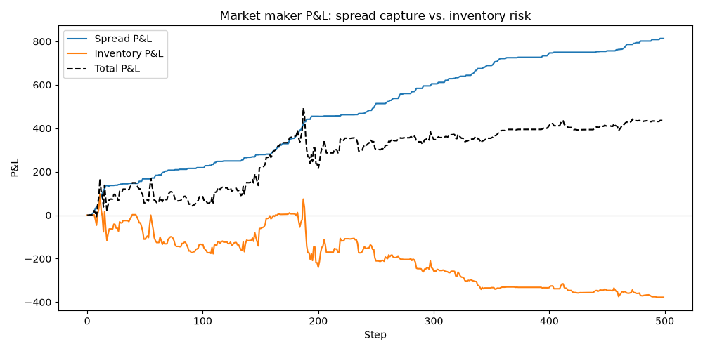
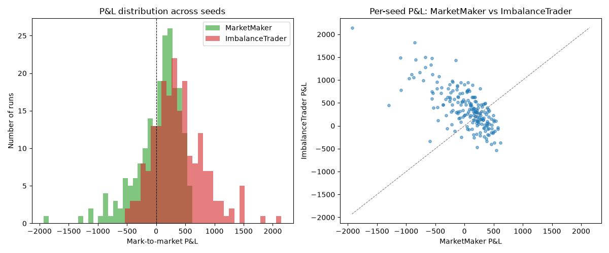
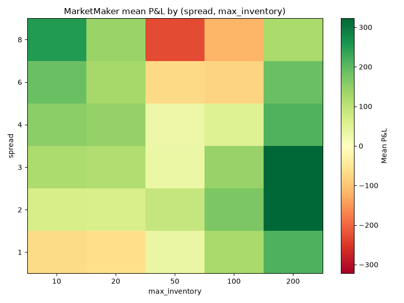
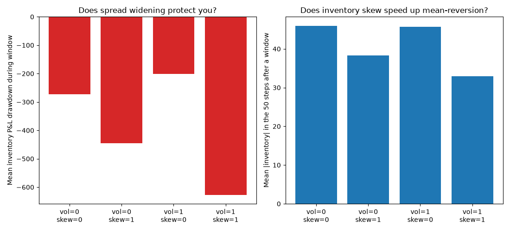

# Market Sim


A limit order book (LOB) simulator written from scratch in Python — the matching engine, random order flow, two contrasting trading agents, and metrics tracking, with a pytest suite and mypy checking the core engine.

## Features

- **Matching engine** (`lob/book.py`) — limit and market orders, price-time priority, partial fills, cancellation. Best bid/ask lookup is heap-based (`O(log n)` amortized) rather than scanning every price level.
- **Random order flow** (`simulator/random_flow.py`) — Poisson-style arrivals of random limit/market orders around the mid price, to simulate a live market.
- **Market maker** (`simulator/market_maker.py`) — quotes a bid and ask around mid every step, tracks its own inventory/cash, skews its quotes against inventory to manage risk, and widens its spread with recent realized volatility (rolling stdev of trade prices) so it quotes tighter in a calm market and pulls back in a choppy one.
- **Imbalance trader** (`simulator/imbalance_trader.py`) — a contrasting agent that trades *with* the book's imbalance instead of against its own inventory.
- **Informed trader** (`simulator/informed_trader.py`) — fed a ground-truth schedule of future price-drift windows and trades directionally while one is active, injecting real adverse selection into the sim instead of relying on incidental noise from the random flow.
- **Metrics** (`metrics/metrics.py`) — tracks mid price, spread, depth, and order book imbalance over a run, and plots them.
- **Depth heatmap** (`metrics/depth_history.py`) — records resting size at every price level relative to mid, each step, and renders it as an L2-style heatmap over time.
- **P&L breakdown** (`metrics/pnl_history.py`) — splits `MarketMaker`'s P&L into spread capture vs. inventory risk every step, and plots them, so a profitable-looking total can't hide getting picked off by informed flow.
- **Tests** (`tests/`) — pytest unit tests covering matching, price-time priority, partial fills, cancellation, and both agents; mypy runs in CI alongside pytest.
- **Benchmarks** (`benchmarks/`) — measures the heap-based best bid/ask lookup against the naive scan it replaced.
- **Strategy comparison** (`analysis/compare_strategies.py`) — runs the simulation across many random seeds and statistically compares `MarketMaker` vs `ImbalanceTrader` P&L, instead of judging either off a single run.
- **Market maker tuning** (`analysis/tune_market_maker.py`) — sweeps `MarketMaker`'s `spread`/`max_inventory` across a grid to check whether its underperformance in the strategy comparison is a tuning problem or something structural.
- **Adverse selection stress test** (`analysis/stress_test_market_maker.py`) — runs `MarketMaker` against an `InformedTrader` with known future drift windows, watches `inventory_pnl` take the hit live, and sweeps volatility widening and inventory skew on/off to check whether either actually protects against it.

## Project structure

```
market_sim/
├── lob/
│   └── book.py                  # core order book: Order, LimitOrderBook
├── simulator/
│   ├── random_flow.py           # random order flow generator
│   ├── market_maker.py          # market-making agent
│   ├── imbalance_trader.py      # imbalance-following agent
│   └── informed_trader.py       # scheduled-drift agent for adverse-selection testing
├── metrics/
│   ├── metrics.py                # metrics tracking + plotting
│   ├── depth_history.py         # per-step depth snapshots + heatmap
│   └── pnl_history.py           # spread vs. inventory P&L tracking + plotting
├── tests/
│   ├── test_book.py             # matching engine tests
│   ├── test_market_maker.py
│   ├── test_imbalance_trader.py
│   ├── test_informed_trader.py
│   ├── test_depth_history.py
│   ├── test_pnl_history.py
│   ├── test_compare_strategies.py
│   ├── test_tune_market_maker.py
│   └── test_stress_test_market_maker.py
├── benchmarks/
│   └── bench_best_price.py      # best bid/ask lookup benchmark
├── analysis/
│   ├── compare_strategies.py       # multi-seed strategy comparison
│   ├── tune_market_maker.py        # market maker parameter sweep
│   └── stress_test_market_maker.py # informed-trader adverse-selection stress test
├── main.py                       # demo entry point
├── requirements.txt
└── diary.md                      # dev log
```

## Quickstart

```bash
git clone <your-repo-url>
cd market_sim
pip install -r requirements.txt
python main.py
```

`main.py` runs a short manual demo — placing, matching, and cancelling orders — then a 500-step random-flow simulation with both agents active, saving a chart of mid price / spread / imbalance to `simulation.png` and a depth heatmap to `depth_heatmap.png`.

## Running tests

```bash
python -m pytest -v
python -m mypy lob simulator metrics analysis --ignore-missing-imports --explicit-package-bases
```

## How the order book works

A limit order book (LOB) is the mechanism an electronic exchange uses to match buyers and sellers in real time. Every time a trader submits an order, the exchange doesn't magically "find a counterparty" — instead it places that order into the book, a structured list of all outstanding buy and sell interest.

Buy orders (bids) are sorted so the highest bid represents the most someone is willing to pay, and sell orders (asks) are sorted so the lowest ask represents the cheapest someone is willing to sell. These two prices form the top of the book, and the difference between them is the **bid-ask spread**, a key measure of market liquidity.

When a new order arrives, the exchange checks whether its price is good enough to trade immediately against the opposite side — this is called being **marketable**. A buy order priced above the best ask will instantly execute against the cheapest available sell orders. Trades always follow **price-time priority**: better prices match first, and among equal prices, older orders match before newer ones. If the incoming order isn't fully filled, whatever remains is added to the book at its limit price.

`LimitOrderBook` stores bids and asks in dictionaries mapping price → FIFO queue, which enforces price-time priority. `_best_bid()`/`_best_ask()` identify the top of the book. When an order arrives through `add_limit_order()`, the book checks whether it's marketable and matches it inside `_match_buy()`/`_match_sell()`, reducing sizes on both sides and recording each trade. Fully filled resting orders are removed from their queues, and empty price levels are deleted. Any unfilled remainder is added to the book. `snapshot()` returns a summary of the current state — best bid/ask, depth at each price, and recent trades.

## How the market maker works

A market maker doesn't bet on direction — it continuously posts both a bid and an ask around the current price, earning the spread on round trips. In exchange for supplying that liquidity, it absorbs inventory risk: every fill pushes its position long or short, so `MarketMaker` skews its quotes against its own inventory (long → quote lower, short → quote higher) to lean back toward flat instead of letting risk build up unbounded, and stops adding to a side once a configurable `max_inventory` limit is hit.

The quoted width isn't fixed either. Each step, `MarketMaker` computes realized volatility as the population stdev of the last `vol_window` trade prices, and widens its base `spread` by `vol_coef * volatility` before splitting it into a half-spread on each side. A calm, range-bound market gets tight quotes; a choppy one gets wider ones, which both protects against getting picked off by a stale quote in a fast-moving market and earns a bigger spread to compensate for the extra risk of holding inventory through it. Since inventory skew is computed as a fraction of that same half-spread, volatility widening also amplifies the skew — a deliberate choice consistent with the rest of the design, not a side effect (see the "danger zone" in the tuning section below for what happens when that interaction is miscalibrated). `vol_coef=0` recovers the original fixed-spread behavior. This is a naive first cut at the idea behind the Avellaneda-Stoikov market-making model — a fuller implementation would also reason about time-to-horizon and risk aversion explicitly rather than folding everything into one linear skew term.

### Where the P&L actually comes from

A single `mark_to_market()` number can't tell you *why* a run made or lost money — a healthy strategy earning the spread and an unhealthy one that got lucky on a directional move can post the same total. `MarketMaker` splits its P&L into two running totals that always sum to the total:

- **`spread_pnl`** — the edge captured on each fill, priced against the mid the quote was centered on at the moment it was posted. Selling above that mid or buying below it is pure liquidity-provision profit, independent of whatever the price does afterwards.
- **`inventory_pnl(book)`** — everything else: the mark-to-market gain or loss on whatever's been carried since each fill, as fair value has drifted since then. This is the cost (or, occasionally, the windfall) of holding directional risk instead of staying flat.

`metrics/pnl_history.py` (`PnLHistory`) records both every step and plots them alongside the total, wired into `simulate_random_flow` the same way as `DepthHistory`. Running `main.py` saves this to `pnl_breakdown.png`:



In this run, `spread_pnl` climbs steadily and almost monotonically — the quoting logic reliably earns its edge — while `inventory_pnl` trends negative and gets worse over the run, dragging down what would otherwise be a much larger total. That's the picture of a market maker doing its core job correctly (capturing the spread) while losing money on the side effect of doing that job (carrying inventory through directional moves) — exactly the failure mode `analysis/tune_market_maker.py` traced to `max_inventory` being pinned too readily during trending runs. Without this split, the total P&L alone would just look mediocre; with it, it's clear *which half* of the strategy needs work.

## Performance

`_best_bid()`/`_best_ask()` used to scan every resting price level with `max()`/`min()` on every call — `O(n)` in the number of price levels, and these are called on nearly every operation. They're now backed by a heap (bids negated to simulate a max-heap; lazy deletion for entries whose price level has since emptied out), which keeps lookups `O(log n)` amortized regardless of how many levels are resting.

```bash
python benchmarks/bench_best_price.py
```

```
  levels    dict max()     heap peek   speedup
      10        1.32ms        0.40ms      3.3x
     100        6.61ms        0.34ms     19.4x
    1000       60.36ms        0.35ms    174.4x
   10000      475.84ms        0.24ms   1987.7x
   50000     2864.49ms        0.27ms  10423.9x
```

## Strategy comparison

A single simulation run only tells you what happened in one random scenario, not whether an agent has a real edge. `analysis/compare_strategies.py` runs the simulation across 200 independent random seeds and compares `MarketMaker` vs `ImbalanceTrader` on final mark-to-market P&L.

```bash
python -m analysis.compare_strategies
```

```
200 runs, 0-199

MarketMaker      mean=    27.24  stdev=  390.58  min= -1929.00  max=   619.00  profitable=125/200 ( 62.5%)
ImbalanceTrader  mean=   378.03  stdev=  438.27  min=  -538.53  max= 2144.81  profitable=164/200 ( 82.0%)

MarketMaker beat ImbalanceTrader head-to-head in 71/200 runs (35.5%)
```

Across this random-flow model, `ImbalanceTrader` comes out ahead on every measure — higher mean P&L, higher win rate, and it beats `MarketMaker` head-to-head in the majority of seeds. `MarketMaker` also has a much fatter downside tail (min of -1929 vs -538), consistent with it sometimes accumulating a large inventory position right as the price moves against it. This says more about how this particular random order flow behaves than it does about market making in general — a real market maker's edge shows up against genuine adverse-selection dynamics that this simplified flow doesn't fully capture — but it's a real, reproducible result rather than an anecdote from one run.



### Is that a tuning problem or something structural?

`analysis/tune_market_maker.py` sweeps `MarketMaker`'s `spread` and `max_inventory` across a grid (`ImbalanceTrader` held fixed, same config as above) to check.

```bash
python -m analysis.tune_market_maker
```



`max_inventory` dominates the picture: `max_inventory=200` is the best or near-best choice at almost every spread tested, and the best configuration found (`spread=2, max_inventory=200`, mean P&L ≈ 322) more than triples the original baseline's mean (≈ 90 over this sweep's 50-seed sample). The original `max_inventory=50` default was simply too conservative — it stops `MarketMaker` from quoting one side too early during a trending run, missing out on further spread capture for the rest of that run.

That's a real improvement, but it still doesn't fully close the gap to `ImbalanceTrader`'s ≈ 378 mean from the comparison above — so the underperformance looks like it's *partly* a tuning issue (fixable, and now mostly fixed) and *partly* structural: within the range tested, a strategy that follows the book's imbalance keeps an edge over one that provides liquidity passively, at least in this random-walk order flow model, which doesn't model the genuine adverse selection a real market maker has to price against.

There's also a striking red "danger zone" in the heatmap — mid-range `max_inventory` (50–100) combined with a wide `spread` (6–8) performs *worse* than a tight spread at the same inventory cap, dropping as low as −227 mean P&L. The likely mechanism: `MarketMaker`'s quote skew scales with `spread`, so a wide spread means large skew swings as inventory approaches its cap — a moderate cap gets pinned there often enough for that miscalibration to bite, whereas a low cap bounds the damage and a high cap rarely gets pinned at all. That's a hypothesis based on the pattern, not fully verified — a good candidate for further digging.

## Adverse selection stress test

Everything above uses random order flow — nobody in the sim actually knows where price is going next, so any adverse selection `MarketMaker` suffers is incidental. `simulator/informed_trader.py` adds `InformedTrader`: fed a ground-truth schedule of future price-drift windows at construction, it just trades a market order in that direction every step a window is active. Its own flow is what causes the drift — real informed trading moves prices for exactly this reason — so this is the simplest possible way to inject *genuine* adverse selection into the sim, on purpose, instead of hoping the random walk produces some.

`analysis/stress_test_market_maker.py` runs `MarketMaker` against two 50-step informed windows (a "buy" drift, then later a "sell" drift) layered on top of the normal random flow, recording `spread_pnl`/`inventory_pnl` via `PnLHistory` throughout:

```bash
python -m analysis.stress_test_market_maker
```


`spread_pnl` keeps climbing steadily straight through both shaded windows — `MarketMaker` is still earning its edge on every individual fill, exactly as the "spread P&L can never go negative" property from Phase 2 predicts. `inventory_pnl` tells the opposite story: it craters right as each window opens, as `MarketMaker` keeps quoting a spread around a mid the informed trader's own flow is actively walking away from it — buying into a rise, then getting caught short into a further fall. That's adverse selection, live, in this run: `spread_pnl` finished at +1608, but `inventory_pnl` finished at −2409 — dragging the total down to −800 despite the strategy earning its spread the entire time.

### Does widening protect you? Does skew help you recover?

Two independent knobs make this directly testable: `vol_coef` (Phase 1 — widens quotes with realized volatility) and a new `skew_coef` (multiplies the inventory-skew term; `skew_coef=0` disables it). Sweeping both across `{0, 1} × {0, 1}`, 30 seeds each, and measuring (a) the worst `inventory_pnl` drawdown reached during each informed window and (b) mean `|inventory|` over the 50 steps after a window ends (how close it's gotten back to flat):

```
vol_coef=0.0  skew_coef=0.0  mean_drawdown=  -272.89  mean_|inventory|_after= 45.99
vol_coef=0.0  skew_coef=1.0  mean_drawdown=  -444.77  mean_|inventory|_after= 38.29
vol_coef=1.0  skew_coef=0.0  mean_drawdown=  -201.00  mean_|inventory|_after= 45.67  <-- smallest drawdown
vol_coef=1.0  skew_coef=1.0  mean_drawdown=  -627.10  mean_|inventory|_after= 32.89  <-- fastest reversion
```



**Skew helps mean-revert, cleanly and consistently.** Both `skew_coef=1.0` rows post a lower `mean_|inventory|_after` than the matching `skew_coef=0.0` row, regardless of `vol_coef` — skewing quotes against inventory does pull the position back toward flat faster once the informed pressure (and whatever was driving it) stops.

**Widening does *not* uniformly protect you — and that's the more interesting result.** At `skew_coef=0`, widening helps as you'd expect: `vol_coef=1.0` cuts the drawdown from −272.89 to −201.00. But at `skew_coef=1`, widening makes the drawdown almost 3x *worse* (−444.77 → −627.10). The mechanism is exactly what `tune_market_maker.py`'s "danger zone" upstream could only hypothesize from a P&L heatmap: `skew = skew_coef * (inventory/max_inventory) * half`, so a wider `half` (from volatility widening) multiplies directly into a bigger *absolute* skew once inventory has built up — right as an informed trader is running that inventory up further. Widening is protective on its own; widening layered on top of an already-engaged skew mechanism amplifies exactly the exposure it was meant to guard against. Two mechanisms that each look sensible in isolation combine into something worse than either alone — this stress test reproduces the actual failure mode the tuning heatmap could only gesture at.

One confound worth flagging in reading the drawdown numbers literally: the informed trader always sends *market* orders, which are marketable regardless of `MarketMaker`'s spread — widening doesn't stop it from trading, it changes *who* it trades against. A wider `MarketMaker` quote sits further from the top of book, so more of the informed flow gets absorbed by other resting random-flow orders instead of `MarketMaker` itself. Both effects (less edge given up per trade against the MM, and being hit less often in the first place) are real, and both are baked into the numbers above — they just aren't separable from this experiment alone.

## Example output

Running `main.py` produces `simulation.png` — mid price, spread, and order book imbalance over the course of the simulated run — and `depth_heatmap.png`, showing resting order book depth by price offset from mid over time (green = bid side, red = ask side):


