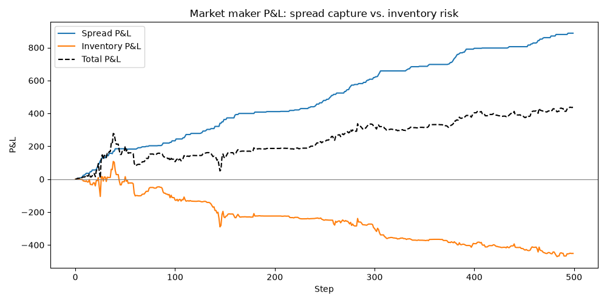

# Market Sim


A limit order book (LOB) simulator written from scratch in Python — the matching engine, random order flow, two contrasting trading agents, and metrics tracking, with a pytest suite and mypy checking the core engine.

## Features

- **Matching engine** (`lob/book.py`) — limit and market orders, price-time priority, partial fills, cancellation. Best bid/ask lookup is heap-based (`O(log n)` amortized) rather than scanning every price level.
- **Random order flow** (`simulator/random_flow.py`) — Poisson-style arrivals of random limit/market orders around the mid price, to simulate a live market.
- **Market maker** (`simulator/market_maker.py`) — quotes a bid and ask around mid every step, tracks its own inventory/cash, skews its quotes against inventory to manage risk, and widens its spread with recent realized volatility (rolling stdev of trade prices) so it quotes tighter in a calm market and pulls back in a choppy one.
- **Imbalance trader** (`simulator/imbalance_trader.py`) — a contrasting agent that trades *with* the book's imbalance instead of against its own inventory.
- **Informed trader** (`simulator/informed_trader.py`) — fed a ground-truth schedule of future price-drift windows and trades directionally while one is active, injecting real adverse selection into the sim instead of relying on incidental noise from the random flow.
- **Metrics** (`metrics/metrics.py`) — tracks mid price, spread, depth, and order book imbalance over a run, and plots them.
- **Depth heatmap** (`metrics/depth_history.py`) — records resting size at every price level relative to mid, each step, and renders it as an L2-style heatmap over time.
- **P&L breakdown** (`metrics/pnl_history.py`) — splits `MarketMaker`'s P&L into spread capture vs. inventory risk every step, and plots them, so a profitable-looking total can't hide getting picked off by informed flow.
- **Tests** (`tests/`) — pytest unit tests covering matching, price-time priority, partial fills, cancellation, and both agents; mypy runs in CI alongside pytest.
- **Benchmarks** (`benchmarks/`) — measures the heap-based best bid/ask lookup against the naive scan it replaced.
- **Strategy comparison** (`analysis/compare_strategies.py`) — runs the simulation across many random seeds and statistically compares `MarketMaker` vs `ImbalanceTrader` P&L, instead of judging either off a single run.
- **Market maker tuning** (`analysis/tune_market_maker.py`) — sweeps `MarketMaker`'s `spread`/`max_inventory` across a grid to check whether its underperformance in the strategy comparison is a tuning problem or something structural.
- **Adverse selection stress test** (`analysis/stress_test_market_maker.py`) — runs `MarketMaker` against an `InformedTrader` with known future drift windows, watches `inventory_pnl` take the hit live, and sweeps volatility widening and inventory skew on/off to check whether either actually protects against it.
- **Avellaneda-Stoikov market maker** (`simulator/avellaneda_stoikov.py`) — a second market-making agent quoting from the actual Avellaneda-Stoikov (2008) optimal-quoting model (a reservation price derived from inventory, risk aversion, variance, and time-to-horizon) instead of `MarketMaker`'s hand-tuned linear heuristic.
- **Avellaneda-Stoikov comparison** (`analysis/avellaneda_stoikov_demo.py`) — runs both market makers through the same informed-trader stress scenario and plots the head-to-head P&L split, plus the reservation price/half-spread compressing toward the trading horizon within a single run.

## Project structure

```
market_sim/
├── lob/
│   └── book.py                  # core order book: Order, LimitOrderBook
├── simulator/
│   ├── random_flow.py           # random order flow generator
│   ├── market_maker.py          # market-making agent
│   ├── imbalance_trader.py      # imbalance-following agent
│   ├── informed_trader.py       # scheduled-drift agent for adverse-selection testing
│   └── avellaneda_stoikov.py    # Avellaneda-Stoikov optimal-quoting market maker
├── metrics/
│   ├── metrics.py                # metrics tracking + plotting
│   ├── depth_history.py         # per-step depth snapshots + heatmap
│   └── pnl_history.py           # spread vs. inventory P&L tracking + plotting
├── tests/
│   ├── test_book.py             # matching engine tests
│   ├── test_market_maker.py
│   ├── test_imbalance_trader.py
│   ├── test_informed_trader.py
│   ├── test_avellaneda_stoikov.py
│   ├── test_depth_history.py
│   ├── test_pnl_history.py
│   ├── test_compare_strategies.py
│   ├── test_tune_market_maker.py
│   └── test_stress_test_market_maker.py
├── benchmarks/
│   └── bench_best_price.py      # best bid/ask lookup benchmark
├── analysis/
│   ├── compare_strategies.py       # multi-seed strategy comparison
│   ├── tune_market_maker.py        # market maker parameter sweep
│   ├── stress_test_market_maker.py # informed-trader adverse-selection stress test
│   └── avellaneda_stoikov_demo.py  # heuristic vs. Avellaneda-Stoikov comparison
├── images/                       # generated charts (all scripts above save here)
├── main.py                       # demo entry point
├── requirements.txt
└── diary.md                      # dev log
```

## Quickstart

```bash
git clone <your-repo-url>
cd market_sim
pip install -r requirements.txt
python main.py
```

`main.py` runs a short manual demo — placing, matching, and cancelling orders — then a 500-step random-flow simulation with both agents active, saving a chart of mid price / spread / imbalance to `images/simulation.png` and a depth heatmap to `images/depth_heatmap.png`.

## Running tests

```bash
python -m pytest -v
python -m mypy lob simulator metrics analysis --ignore-missing-imports --explicit-package-bases
```

## How the order book works

A limit order book (LOB) is the mechanism an electronic exchange uses to match buyers and sellers in real time. Every time a trader submits an order, the exchange doesn't magically "find a counterparty" — instead it places that order into the book, a structured list of all outstanding buy and sell interest.

Buy orders (bids) are sorted so the highest bid represents the most someone is willing to pay, and sell orders (asks) are sorted so the lowest ask represents the cheapest someone is willing to sell. These two prices form the top of the book, and the difference between them is the **bid-ask spread**, a key measure of market liquidity.

When a new order arrives, the exchange checks whether its price is good enough to trade immediately against the opposite side — this is called being **marketable**. A buy order priced above the best ask will instantly execute against the cheapest available sell orders. Trades always follow **price-time priority**: better prices match first, and among equal prices, older orders match before newer ones. If the incoming order isn't fully filled, whatever remains is added to the book at its limit price.

`LimitOrderBook` stores bids and asks in dictionaries mapping price → FIFO queue, which enforces price-time priority. `_best_bid()`/`_best_ask()` identify the top of the book. When an order arrives through `add_limit_order()`, the book checks whether it's marketable and matches it inside `_match_buy()`/`_match_sell()`, reducing sizes on both sides and recording each trade. Fully filled resting orders are removed from their queues, and empty price levels are deleted. Any unfilled remainder is added to the book. `snapshot()` returns a summary of the current state — best bid/ask, depth at each price, and recent trades.

## How the market maker works

A market maker doesn't bet on direction — it continuously posts both a bid and an ask around the current price, earning the spread on round trips. In exchange for supplying that liquidity, it absorbs inventory risk: every fill pushes its position long or short, so `MarketMaker` skews its quotes against its own inventory (long → quote lower, short → quote higher) to lean back toward flat instead of letting risk build up unbounded, and stops adding to a side once a configurable `max_inventory` limit is hit.

The quoted width isn't fixed either. Each step, `MarketMaker` computes realized volatility as the population stdev of the last `vol_window` trade prices, and widens its base `spread` by `vol_coef * volatility` before splitting it into a half-spread on each side. A calm, range-bound market gets tight quotes; a choppy one gets wider ones, which both protects against getting picked off by a stale quote in a fast-moving market and earns a bigger spread to compensate for the extra risk of holding inventory through it. Since inventory skew is computed as a fraction of that same half-spread, volatility widening also amplifies the skew — a deliberate choice consistent with the rest of the design, not a side effect (see the "danger zone" in the tuning section below for what happens when that interaction is miscalibrated). `vol_coef=0` recovers the original fixed-spread behavior.

### Limitations of the linear heuristic

`vol_coef` and `skew_coef` are hand-picked, empirically tuned constants, not derived from anything. That's fine as a first cut, but it leaves real gaps compared to a principled quoting model like Avellaneda-Stoikov (2008) — implemented separately below:

- **No time horizon.** `MarketMaker` behaves identically on step 1 and step 499 of a run — there's no notion of being less willing to carry risk as a trading session's end approaches.
- **The two knobs can interact badly.** `vol_coef` and `skew_coef` were each reasonable in isolation, but the adverse-selection stress test above found they compound into a *worse* drawdown together — skew scales with the volatility-widened half-spread, amplifying exposure exactly when an informed trader is pushing inventory further from flat.
- **Volatility is estimated from price levels, not increments.** `_realized_volatility` is the stdev of recent trade *prices*, a loose proxy — it isn't the variance of the price *process* a diffusion-based model actually needs.
- **Inventory skew is capped by construction.** `skew_coef * (inventory / max_inventory) * half` can never exceed half the spread, regardless of how large or risky the position is; the cap falls out of the formula's shape, not a deliberate risk decision.
- **No explicit risk-aversion parameter.** "How much do I hate carrying inventory" has no dedicated, interpretable knob — it's folded into `skew_coef` with no economic meaning attached.
- **The base spread has no market-microstructure grounding.** The fixed `spread` constant isn't tied to any model of how counterparty order-arrival likelihood falls off with quote distance; it's just picked.

`AvellanedaStoikovMarketMaker` (`simulator/avellaneda_stoikov.py`) addresses each of these directly: an explicit `total_steps`/`t` horizon fixes the first; a single formula derived from inventory, risk aversion, variance, and time-to-horizon replaces the two independently-tuned knobs, fixing the second; a proper increment-based variance estimator fixes the third; the reservation-price skew `q·γ·σ²·(T-t)` falls out of the math rather than being capped, fixing the fourth; an explicit `gamma` parameter fixes the fifth; and the `k`-driven floor term ties the spread to a model of order-arrival decay, fixing the sixth. It's not a free lunch, though — `gamma` and `k` are still hand-picked for this toy sim rather than calibrated to real market data, and getting it to run stably in this particular simulator required its own new safeguard (see the class docstring and the section below).

### Where the P&L actually comes from

A single `mark_to_market()` number can't tell you *why* a run made or lost money — a healthy strategy earning the spread and an unhealthy one that got lucky on a directional move can post the same total. `MarketMaker` splits its P&L into two running totals that always sum to the total:

- **`spread_pnl`** — the edge captured on each fill, priced against the mid the quote was centered on at the moment it was posted. Selling above that mid or buying below it is pure liquidity-provision profit, independent of whatever the price does afterwards.
- **`inventory_pnl(book)`** — everything else: the mark-to-market gain or loss on whatever's been carried since each fill, as fair value has drifted since then. This is the cost (or, occasionally, the windfall) of holding directional risk instead of staying flat.

`metrics/pnl_history.py` (`PnLHistory`) records both every step and plots them alongside the total, wired into `simulate_random_flow` the same way as `DepthHistory`. Running `main.py` saves this to `images/pnl_breakdown.png`:



In this run, `spread_pnl` climbs steadily and almost monotonically — the quoting logic reliably earns its edge — while `inventory_pnl` trends negative and gets worse over the run, dragging down what would otherwise be a much larger total. That's the picture of a market maker doing its core job correctly (capturing the spread) while losing money on the side effect of doing that job (carrying inventory through directional moves) — exactly the failure mode `analysis/tune_market_maker.py` traced to `max_inventory` being pinned too readily during trending runs. Without this split, the total P&L alone would just look mediocre; with it, it's clear *which half* of the strategy needs work.

## Performance

`_best_bid()`/`_best_ask()` used to scan every resting price level with `max()`/`min()` on every call — `O(n)` in the number of price levels, and these are called on nearly every operation. They're now backed by a heap (bids negated to simulate a max-heap; lazy deletion for entries whose price level has since emptied out), which keeps lookups `O(log n)` amortized regardless of how many levels are resting.

```bash
python benchmarks/bench_best_price.py
```

```
  levels    dict max()     heap peek   speedup
      10        1.32ms        0.40ms      3.3x
     100        6.61ms        0.34ms     19.4x
    1000       60.36ms        0.35ms    174.4x
   10000      475.84ms        0.24ms   1987.7x
   50000     2864.49ms        0.27ms  10423.9x
```

## Strategy comparison

A single simulation run only tells you what happened in one random scenario, not whether an agent has a real edge. `analysis/compare_strategies.py` runs the simulation across 200 independent random seeds and compares `MarketMaker` vs `ImbalanceTrader` on final mark-to-market P&L.

```bash
python -m analysis.compare_strategies
```

```
200 runs, 0-199

MarketMaker      mean=   -77.97  stdev=  571.09  min= -3049.94  max=   764.50  profitable=111/200 ( 55.5%)
ImbalanceTrader  mean=   663.39  stdev=  765.25  min=  -668.82  max= 3014.50  profitable=161/200 ( 80.5%)

MarketMaker beat ImbalanceTrader head-to-head in 62/200 runs (31.0%)
```

Across this random-flow model, `ImbalanceTrader` comes out ahead on every measure — higher mean P&L, higher win rate, and it beats `MarketMaker` head-to-head in the large majority of seeds. `MarketMaker`'s mean P&L is now negative, with a dramatically fatter downside tail (min of -3049.94, versus -1929.00 the first time this comparison was run) — a direct consequence of `MarketMaker` now widening its spread with volatility and skewing its quotes against inventory by default (`vol_coef=1.0`, `skew_coef=1.0`, both added after this comparison was first generated). At its default config (`spread=2, max_inventory=50`), that combination sits squarely inside the worst zone the tuning sweep below now finds — see "Is that a tuning problem or something structural?" for why. This says more about how this particular random order flow interacts with `MarketMaker`'s current default tuning than it does about market making in general — a real market maker's edge shows up against genuine adverse-selection dynamics this simplified flow doesn't fully capture, and a different `spread`/`max_inventory` choice moves these numbers substantially — but it's a real, reproducible result rather than an anecdote from one run.


### Is that a tuning problem or something structural?

`analysis/tune_market_maker.py` sweeps `MarketMaker`'s `spread` and `max_inventory` across a grid (`ImbalanceTrader` held fixed, same config as above) to check.

```bash
python -m analysis.tune_market_maker
```


The picture here has changed since this sweep was first generated: `MarketMaker` now widens its spread with realized volatility and skews its quotes against inventory by default (`vol_coef=1.0`, `skew_coef=1.0`, added in later phases — see "How the market maker works" above), neither of which existed the first time this grid was run. Re-running it against current defaults flips the previous conclusion. The best configuration is now `spread=8, max_inventory=10` (mean P&L ≈ 386.98, 94% profitable) — a *tight* inventory cap paired with a *wide* spread, the opposite of the old advice to raise `max_inventory`. `max_inventory=200` is still solidly positive at every spread tested (129 to 337 mean P&L), but it's no longer the best choice at any of them.

The mid-range caps are the clear losers now instead. `max_inventory=50` and `max_inventory=100` are barely positive at `spread=1` and get steadily worse as spread widens, bottoming out at −405 mean P&L (`spread=8, max_inventory=50`) — well past the old "danger zone" this section used to describe as an edge case. The likely mechanism is the one the adverse-selection stress test below later confirmed in isolation: inventory skew scales with the volatility-widened half-spread, so once a position is large enough to matter, a wider spread means a proportionally bigger skew swing. A tight cap (`max_inventory=10`) never lets inventory get big enough for that to bite; a high cap (`max_inventory=200`) rarely gets pinned in the first place, so the amplified skew stays modest relative to the position size; a moderate cap gets pinned often enough, at a large enough size, for the amplified skew to actively hurt. That's still inferred from the pattern rather than isolated directly in this script — but it's the same mechanism the stress test's `vol_coef`/`skew_coef` grid measured directly and found real, so it's on firmer ground than when this section first floated it as a hypothesis.

This also explains why `MarketMaker`'s numbers in the strategy comparison above got *worse*, not better, once the volatility/skew defaults went live: `compare_strategies.py` runs `MarketMaker` at `spread=2, max_inventory=50` — squarely inside the zone this sweep now finds worst (mean P&L −66.85 at that exact config, in this sweep's own sample). Even the new best (≈387) doesn't close the gap to `ImbalanceTrader`'s ≈663 mean from the fresh comparison above, so the underperformance is still *partly* a tuning issue and *partly* structural — but "tuning" now points toward a tighter inventory cap and a wider spread, the opposite of what this section originally recommended.

## Adverse selection stress test

Everything above uses random order flow — nobody in the sim actually knows where price is going next, so any adverse selection `MarketMaker` suffers is incidental. `simulator/informed_trader.py` adds `InformedTrader`: fed a ground-truth schedule of future price-drift windows at construction, it just trades a market order in that direction every step a window is active. Its own flow is what causes the drift — real informed trading moves prices for exactly this reason — so this is the simplest possible way to inject *genuine* adverse selection into the sim, on purpose, instead of hoping the random walk produces some.

`analysis/stress_test_market_maker.py` runs `MarketMaker` against two 50-step informed windows (a "buy" drift, then later a "sell" drift) layered on top of the normal random flow, recording `spread_pnl`/`inventory_pnl` via `PnLHistory` throughout:

```bash
python -m analysis.stress_test_market_maker
```


`spread_pnl` keeps climbing steadily straight through both shaded windows — `MarketMaker` is still earning its edge on every individual fill, exactly as the "spread P&L can never go negative" property from Phase 2 predicts. `inventory_pnl` tells the opposite story: it craters right as each window opens, as `MarketMaker` keeps quoting a spread around a mid the informed trader's own flow is actively walking away from it — buying into a rise, then getting caught short into a further fall. That's adverse selection, live, in this run: `spread_pnl` finished at +1608, but `inventory_pnl` finished at −2409 — dragging the total down to −800 despite the strategy earning its spread the entire time.

### Does widening protect you? Does skew help you recover?

Two independent knobs make this directly testable: `vol_coef` (Phase 1 — widens quotes with realized volatility) and a new `skew_coef` (multiplies the inventory-skew term; `skew_coef=0` disables it). Sweeping both across `{0, 1} × {0, 1}`, 30 seeds each, and measuring (a) the worst `inventory_pnl` drawdown reached during each informed window and (b) mean `|inventory|` over the 50 steps after a window ends (how close it's gotten back to flat):

```
vol_coef=0.0  skew_coef=0.0  mean_drawdown=  -272.89  mean_|inventory|_after= 45.99
vol_coef=0.0  skew_coef=1.0  mean_drawdown=  -444.77  mean_|inventory|_after= 38.29
vol_coef=1.0  skew_coef=0.0  mean_drawdown=  -201.00  mean_|inventory|_after= 45.67  <-- smallest drawdown
vol_coef=1.0  skew_coef=1.0  mean_drawdown=  -627.10  mean_|inventory|_after= 32.89  <-- fastest reversion
```


**Skew helps mean-revert, cleanly and consistently.** Both `skew_coef=1.0` rows post a lower `mean_|inventory|_after` than the matching `skew_coef=0.0` row, regardless of `vol_coef` — skewing quotes against inventory does pull the position back toward flat faster once the informed pressure (and whatever was driving it) stops.

**Widening does *not* uniformly protect you — and that's the more interesting result.** At `skew_coef=0`, widening helps as you'd expect: `vol_coef=1.0` cuts the drawdown from −272.89 to −201.00. But at `skew_coef=1`, widening makes the drawdown almost 3x *worse* (−444.77 → −627.10). The mechanism is exactly what `tune_market_maker.py`'s "danger zone" upstream could only hypothesize from a P&L heatmap: `skew = skew_coef * (inventory/max_inventory) * half`, so a wider `half` (from volatility widening) multiplies directly into a bigger *absolute* skew once inventory has built up — right as an informed trader is running that inventory up further. Widening is protective on its own; widening layered on top of an already-engaged skew mechanism amplifies exactly the exposure it was meant to guard against. Two mechanisms that each look sensible in isolation combine into something worse than either alone — this stress test reproduces the actual failure mode the tuning heatmap could only gesture at.

One confound worth flagging in reading the drawdown numbers literally: the informed trader always sends *market* orders, which are marketable regardless of `MarketMaker`'s spread — widening doesn't stop it from trading, it changes *who* it trades against. A wider `MarketMaker` quote sits further from the top of book, so more of the informed flow gets absorbed by other resting random-flow orders instead of `MarketMaker` itself. Both effects (less edge given up per trade against the MM, and being hit less often in the first place) are real, and both are baked into the numbers above — they just aren't separable from this experiment alone.

## Avellaneda-Stoikov market maker

`simulator/avellaneda_stoikov.py` implements the actual Avellaneda-Stoikov (2008) optimal-quoting model instead of the linear heuristic above. Each step it computes a *reservation price* — the price it would be indifferent to trading at given its inventory, risk aversion (`gamma`), recent price variance, and how much of a trading horizon (`total_steps`) remains — and quotes a spread around that reservation price, not around mid:

```
reservation = mid - inventory * gamma * sigma^2 * time_remaining
spread      = gamma * sigma^2 * time_remaining + (2 / gamma) * ln(1 + gamma / k)
```

Both terms involving `time_remaining` shrink to zero as the horizon is reached, so quotes flatten toward a pure microstructure width near the end of a run — a genuine time dimension the linear heuristic doesn't have. `AvellanedaStoikovMarketMaker` subclasses `MarketMaker` and overrides only the pricing step (`_compute_quote_prices`, extracted from `MarketMaker.quote()` specifically to make this possible), so it reuses the exact same settle/cancel/repost loop and spread/inventory P&L split as everything above.

**A real stability bug turned up building this, not a hypothetical one.** The paper assumes an exogenous mid-price process the market maker is too small to move; in this sim, the market maker's own resting quotes are usually the top of book, so that assumption doesn't hold. First attempt: a moderately-sized inventory combined with an entirely normal, honestly-computed volatility uptick pushed the reservation price tens of units from mid, which got the quote hit, which produced a large price jump, which fed straight into the *next* step's variance estimate — pushing the following quote even further out. That fed back on itself and blew up into a nonsensical multi-million-unit quote within about 20 steps, confirmed by tracing the exact sequence (inventory, sigma², and the resulting shift, step by step) rather than just guessing at smaller constants and hoping. The fix ended up being two safeguards, not one: capping how much the variance term can grow in a single step (so one large trade can't compound), and — the one that actually mattered — clamping the inventory skew to at most half the spread, the same invariant `MarketMaker`'s own linear skew already guarantees by construction, so a quote can be pulled all the way to fair value but never pushed through it. Both are documented in the class docstring as sanity clamps layered on top of the textbook formula, not part of it.

`analysis/avellaneda_stoikov_demo.py` runs both market makers through the identical informed-trader stress scenario from the section above (same schedule, same seed):

```bash
python -m analysis.avellaneda_stoikov_demo
```

```
MarketMaker:                 spread_pnl=1608.38, inventory_pnl=-2408.77, total=-800.39
AvellanedaStoikovMarketMaker: spread_pnl=818.93,  inventory_pnl=-1359.49, total=-540.56
```


`AvellanedaStoikovMarketMaker` takes a noticeably smaller `inventory_pnl` hit through both shaded informed windows (-1359 vs. -2409) and ends with a better total, at the cost of capturing less `spread_pnl` (819 vs. 1608) — it's quoting tighter overall, so it earns less per fill but also carries less exposure into the adverse moves. That's the reservation-price mechanism doing its job: unlike the linear heuristic, the inventory term here isn't bounded by a hand-picked coefficient, it's driven by the same variance estimate that widens the spread.

The second plot shows the effect the linear heuristic structurally cannot produce — reservation price and half-spread compressing toward the horizon within a single run:


Half-spread tracks realized volatility for most of the run (bumps up during choppier stretches, including around the informed windows), but in the final ~100 steps it converges tightly onto the pure `k`-driven floor (~0.667) regardless of what volatility is doing at that moment, as `time_remaining` runs down to zero — exactly the horizon-flattening behavior the model predicts and the heuristic MM has no mechanism to produce at all.

### Is this actually high-frequency trading?

Not in any operational sense, even though the model comes from a paper titled "High-frequency trading in a limit order book" and the strategy it describes — continuously re-quoting both sides, adjusting every tick — is exactly what real HFT desks run. What this project simulates is the *strategy*, not the *speed* real HFT needs to run it profitably. Concretely, it doesn't model:

- **Wall-clock time or latency.** A "step" is a sequential tick, not a microsecond or millisecond — there's no notion of how fast a quote update reaches the exchange relative to anyone else's.
- **Competition for speed.** Real HFT market making is a race: whoever requotes a stale price first avoids getting picked off. This sim has price-time priority *within* the book (`lob/book.py`), but no other participant racing to requote faster than this market maker.
- **An exogenous price process.** The paper assumes the market is large enough that one participant's own quotes don't move the "true" price. In this sim they do — the market maker's own resting orders are often the best bid/ask — which is exactly what caused the feedback-loop bug described above, not a separate issue.
- **Calibrated parameters.** `gamma` and `k` are hand-picked to keep this particular sim's price scale stable, not fit from real market data or observed fill rates.
- **Realistic order flow.** Counterparties are a synthetic random-order generator (`simulator/random_flow.py`) plus two scripted agents (`ImbalanceTrader`, `InformedTrader`) — not real, adversarial participants reacting to this market maker the way real counterparties would.

So: a genuine implementation of a market-making *model* drawn from the HFT literature, running inside a toy discrete-event simulator that makes no attempt to model the speed, latency, or competitive dynamics "high-frequency" actually refers to.

## Example output

Running `main.py` produces `images/simulation.png` — mid price, spread, and order book imbalance over the course of the simulated run — and `images/depth_heatmap.png`, showing resting order book depth by price offset from mid over time (green = bid side, red = ask side):


